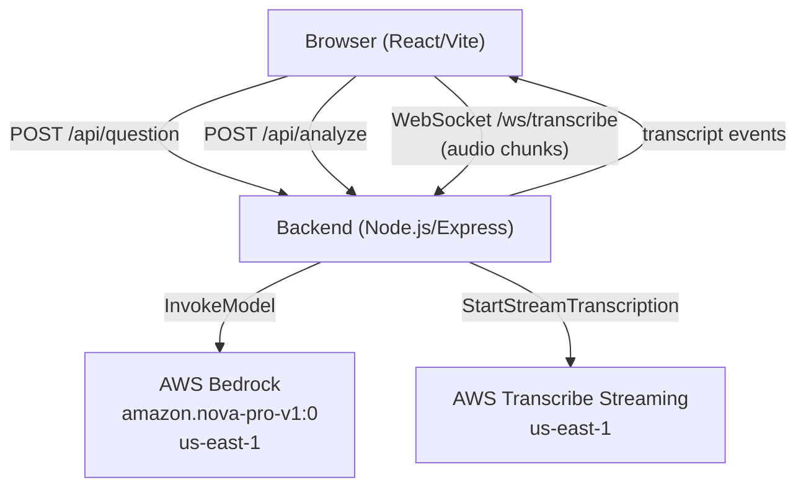

# Design Document: AI Interview Coach

## Overview

The AI Interview Coach is a single-page web application that lets college students and entry-level candidates practice behavioral interview questions. The user generates a question via AWS Bedrock, records a spoken response, sees a live transcription powered by AWS Transcribe, and receives structured STAR-format feedback from AWS Bedrock.

The application is intentionally lightweight: no database, no authentication, no persistence between sessions. All state lives in memory for the duration of a browser session.

**Key design goals:**
- Minimal moving parts — one frontend, one backend, two AWS services
- Real-time feel — transcription updates as the user speaks
- Encouraging UX — feedback is coach-like, not evaluative

---

## Architecture

The system has three layers:

1. **Frontend** — React/Vite SPA running in the browser
2. **Backend** — Node.js/Express server that proxies AWS calls and manages the WebSocket
3. **AWS Services** — Bedrock (Nova Pro) for LLM tasks, Transcribe Streaming for speech-to-text



The backend acts as a secure proxy: AWS credentials never reach the browser. The WebSocket connection between browser and backend carries raw audio in one direction and transcript text events in the other.

### Request Flow: Question Generation

1. User clicks "Generate Question"
2. Frontend sends `POST /api/question`
3. Backend calls Bedrock `InvokeModel` with a prompt requesting a behavioral question
4. Backend returns the question text as JSON
5. Frontend displays the question

### Request Flow: Practice Session

1. User clicks "Start Practice Session"
2. Frontend requests microphone access
3. On grant, frontend opens WebSocket to `/ws/transcribe` and starts streaming audio chunks
4. Backend opens AWS Transcribe streaming session, forwards audio
5. AWS Transcribe returns partial/final transcripts; backend forwards them over the WebSocket
6. User clicks "Stop Session"
7. Frontend closes WebSocket; backend closes Transcribe session
8. Frontend sends `POST /api/analyze` with question + full transcription
9. Backend calls Bedrock, parses response into Feedback object, returns JSON
10. Frontend renders feedback panel

---

## Components and Interfaces

### Frontend Components

```
App
├── QuestionPanel
│   ├── GenerateButton
│   └── QuestionDisplay
├── SessionPanel
│   ├── SessionControls (Start/Stop buttons)
│   ├── Timer
│   └── TranscriptionDisplay
└── FeedbackPanel
    ├── StarAnalysis
    ├── StrengthsList
    ├── ImprovementsList
    └── ActionableTipsList
```

**App** — root component, owns all application state:
- `question: string | null`
- `sessionState: 'idle' | 'active' | 'ended'`
- `transcription: string`
- `feedback: Feedback | null`
- `isLoading: boolean`
- `error: string | null`

**QuestionPanel** — displays the current question and the Generate button. Disables the button when `sessionState === 'active'`.

**SessionPanel** — shows Start/Stop controls, the running timer, and the live transcription area. Manages the WebSocket connection lifecycle.

**Timer** — counts up from 00:00 while session is active. Uses `setInterval` internally.

**TranscriptionDisplay** — renders the cumulative transcript string, updating on each WebSocket message.

**FeedbackPanel** — renders the structured Feedback object after a session ends. Shows a loading indicator while analysis is in flight. Clears when a new session starts.

### Backend Modules

```
server/
├── index.js          — Express app setup, route registration, WebSocket upgrade
├── routes/
│   ├── question.js   — POST /api/question handler
│   └── analyze.js    — POST /api/analyze handler
└── services/
    ├── bedrock.js    — AWS Bedrock client wrapper
    └── transcribe.js — AWS Transcribe streaming wrapper
```

**`bedrock.js`** — wraps `@aws-sdk/client-bedrock-runtime`. Exposes two functions:
- `generateQuestion(category?)` → `Promise<string>`
- `analyzeResponse(question, transcription)` → `Promise<Feedback>`

**`transcribe.js`** — wraps `@aws-sdk/client-transcribe-streaming`. Exposes:
- `startTranscriptionSession(audioStream)` → async generator of transcript events

**`question.js` route** — validates optional `category` field, calls `bedrock.generateQuestion`, returns `{ question: string }`.

**`analyze.js` route** — validates required `question` and `transcription` fields (400 if missing), calls `bedrock.analyzeResponse`, returns the Feedback object.

**WebSocket handler** — on upgrade to `/ws/transcribe`, pipes incoming binary frames to `transcribe.startTranscriptionSession`, emits `{ type: 'transcript', text: string }` and `{ type: 'error', message: string }` events back to the client.

### REST API Contract

#### `POST /api/question`

Request body (optional):
```json
{ "category": "leadership" }
```

Success response `200`:
```json
{ "question": "Tell me about a time when you had to lead a team through a difficult situation." }
```

Error response `500`:
```json
{ "error": "Failed to generate question: <reason>" }
```

#### `POST /api/analyze`

Request body (required):
```json
{
  "question": "Tell me about a time when...",
  "transcription": "So last year I was working on..."
}
```

Success response `200`:
```json
{
  "starAnalysis": {
    "situation": true,
    "task": false,
    "action": true,
    "result": true
  },
  "strengths": ["Clear description of the situation", "Specific actions taken"],
  "areasForImprovement": ["Task component was not clearly stated"],
  "actionableTips": [
    "Start by explicitly stating what your role was in the situation.",
    "End with a quantifiable result to make your answer more impactful."
  ]
}
```

Error response `400` (missing fields):
```json
{ "error": "Missing required fields: question, transcription" }
```

Error response `500`:
```json
{ "error": "Failed to analyze response: <reason>" }
```

#### WebSocket `/ws/transcribe`

Client → Server: binary audio frames (PCM 16-bit, 16kHz, mono)

Server → Client messages (JSON):
```json
{ "type": "transcript", "text": "So last year I was working on a project..." }
{ "type": "error", "message": "Transcription connection interrupted" }
```

---

## Data Models

### `Feedback`

```typescript
interface Feedback {
  starAnalysis: {
    situation: boolean;
    task: boolean;
    action: boolean;
    result: boolean;
  };
  strengths: string[];           // 1+ items
  areasForImprovement: string[]; // 1+ items
  actionableTips: string[];      // exactly 2–3 items
}
```

### `AppState` (frontend in-memory)

```typescript
type SessionState = 'idle' | 'active' | 'ended';

interface AppState {
  question: string | null;
  sessionState: SessionState;
  transcription: string;
  elapsedSeconds: number;
  feedback: Feedback | null;
  isLoadingQuestion: boolean;
  isLoadingFeedback: boolean;
  error: string | null;
}
```

### Bedrock Prompt Structures

**Question generation prompt** (system + user):
```
System: You are an interview coach helping college students and entry-level candidates practice behavioral interviews. Generate exactly one behavioral interview question from the following category: {category}. Return only the question text, no preamble.

User: Generate a behavioral interview question.
```

**Response analysis prompt**:
```
System: You are an encouraging interview coach. Analyze the following interview response using the STAR framework (Situation, Task, Action, Result). Return a JSON object with these exact fields: starAnalysis (object with boolean fields situation/task/action/result), strengths (array of strings), areasForImprovement (array of strings), actionableTips (array of exactly 2-3 strings). Use an encouraging, supportive tone.

User: Question: {question}\n\nResponse: {transcription}
```

### Audio Format

Audio streamed from browser to backend:
- Format: PCM 16-bit signed integer
- Sample rate: 16,000 Hz
- Channels: 1 (mono)
- Chunk size: ~100ms of audio per WebSocket frame

This matches AWS Transcribe Streaming's expected input format.

---

## Correctness Properties

*A property is a characteristic or behavior that should hold true across all valid executions of a system — essentially, a formal statement about what the system should do. Properties serve as the bridge between human-readable specifications and machine-verifiable correctness guarantees.*

### Property 1: Question generation produces non-empty output for any valid category

*For any* valid category string (leadership, teamwork, conflict resolution, problem-solving, failure/learning, time management), calling `generateQuestion(category)` with a mocked Bedrock client should produce a non-empty string, and the prompt sent to Bedrock should contain the category name.

**Validates: Requirements 1.2**

---

### Property 2: Timer formats any elapsed time as MM:SS

*For any* non-negative integer number of elapsed seconds, the timer formatting function should return a string matching the pattern `MM:SS` where `MM` is `floor(seconds / 60)` zero-padded to two digits and `SS` is `seconds % 60` zero-padded to two digits.

**Validates: Requirements 2.5**

---

### Property 3: Transcription pipeline forwards audio and emits transcripts

*For any* audio chunk received on the backend WebSocket, the transcription service should forward it to AWS Transcribe (verified via mock); and *for any* transcript text returned by the mocked Transcribe service, the backend should emit a `{ type: "transcript", text }` WebSocket message to the connected client.

**Validates: Requirements 3.3, 3.4**

---

### Property 4: Cumulative transcription accumulates all received text

*For any* sequence of transcript update strings received by the frontend, the transcription display area should show the full cumulative text after all updates have been applied.

**Validates: Requirements 3.5**

---

### Property 5: Feedback parsing produces a well-formed Feedback object

*For any* valid JSON string returned by the mocked Bedrock analysis call, the `analyzeResponse` function should return a `Feedback` object where: `starAnalysis` contains boolean fields for all four STAR components; `strengths` and `areasForImprovement` are non-empty arrays; and `actionableTips` contains exactly 2 or 3 items.

**Validates: Requirements 4.3**

---

### Property 6: FeedbackPanel renders all sections with visual STAR distinction

*For any* valid `Feedback` object, rendering the `FeedbackPanel` component should produce output that contains all four sections (STAR Analysis, Strengths, Areas for Improvement, Actionable Tips); and *for any* `starAnalysis` object with a mix of `true` and `false` values, the rendered STAR Analysis section should apply visually distinct treatment to present components versus missing components.

**Validates: Requirements 4.4, 4.5**

---

### Property 7: Loading indicator is shown during any loading state

*For any* application state where `isLoadingQuestion` or `isLoadingFeedback` is `true`, the rendered application should contain a visible loading indicator element.

**Validates: Requirements 5.7**

---

### Property 8: Backend returns appropriate error responses for all failure modes

*For any* request to `POST /api/analyze` with one or more missing required fields (`question`, `transcription`), the backend should return HTTP 400 with a descriptive error message; and *for any* mocked AWS service error thrown during any endpoint handler, the backend should return an HTTP 5xx response with a descriptive error message.

**Validates: Requirements 6.5, 6.6**

---

## Error Handling

The application uses a simple, consistent error handling strategy appropriate for a single-user local tool.

### Backend Error Handling

- All route handlers are wrapped in try/catch
- AWS SDK errors are caught and translated to HTTP error responses
- 400 is returned for missing/invalid request fields
- 500 is returned for AWS service failures
- Error messages are descriptive but do not expose internal stack traces

```javascript
// Pattern used in all route handlers
try {
  const result = await bedrockService.generateQuestion(category);
  res.json({ question: result });
} catch (err) {
  res.status(500).json({ error: `Failed to generate question: ${err.message}` });
}
```

### WebSocket Error Handling

- If the AWS Transcribe connection drops, the backend emits `{ type: 'error', message: '...' }` to the client
- The frontend displays the error message in the transcription area
- The session is considered ended on a transcription error

### Frontend Error Handling

- All API calls are wrapped in try/catch
- Errors are stored in `AppState.error` and displayed in the relevant UI area
- Loading states are always cleared in the finally block to prevent stuck spinners

### Not Handled (Out of Scope)

- Automatic retry on failure
- Partial transcript recovery after WebSocket interruption
- Graceful degradation when AWS services are unavailable

---

## Testing Strategy

Given the project constraints (no unit test infrastructure), this section documents the intended testing approach for reference.

### PBT Applicability Assessment

This feature contains several pure functions and transformation pipelines that are well-suited for property-based testing:
- Timer formatting (pure function, large input space)
- Feedback parsing (transformation of Bedrock response to typed object)
- Transcription accumulation (stateful but pure accumulation logic)
- Backend validation and error handling (input-dependent behavior)

PBT is **not** appropriate for:
- AWS service wiring (SMOKE tests)
- UI layout and color scheme (visual inspection)
- Qualitative requirements like tone (manual review)

### Property-Based Testing

**Library**: [fast-check](https://github.com/dubzzz/fast-check) (JavaScript/TypeScript)

**Configuration**: Minimum 100 iterations per property test.

**Tag format**: `// Feature: interview-coach, Property {N}: {property_text}`

Each correctness property maps to a single property-based test:

| Property | Test Description | Generators |
|----------|-----------------|------------|
| P1: Question generation | `fc.constantFrom(...categories)` → verify non-empty output and prompt contains category | Category strings |
| P2: Timer formatting | `fc.nat()` → verify MM:SS format | Non-negative integers |
| P3: Transcription pipeline | `fc.uint8Array()` → verify forwarding; `fc.string()` → verify emit | Audio bytes, transcript strings |
| P4: Cumulative transcription | `fc.array(fc.string())` → verify accumulation | Arrays of transcript strings |
| P5: Feedback parsing | `fc.record({...})` → verify Feedback structure | Valid Feedback-shaped objects |
| P6: FeedbackPanel rendering | `fc.record({starAnalysis: fc.record({...booleans}), ...})` → verify all sections present | Valid Feedback objects |
| P7: Loading indicator | `fc.boolean()` × 2 → verify indicator shown when either is true | Boolean loading flags |
| P8: Backend error handling | `fc.subarray(['question','transcription'])` → verify 400; `fc.string()` → verify 500 | Missing field combinations, error messages |

### Example-Based Tests

For specific behaviors not covered by properties:
- Initial render shows Generate Question as primary CTA
- Session start/stop button visibility toggles correctly
- Empty transcription does not trigger analysis call
- Microphone denial shows permission error message
- All required UI elements present on single page

### Integration Tests

- WebSocket connection lifecycle (connect, stream, disconnect)
- End-to-end session flow with mocked AWS services

### Manual / Smoke Tests

- Black and white color scheme visual check
- Encouraging tone in generated feedback
- Question appropriateness for entry-level candidates
- AWS credentials loaded from environment (not hard-coded)
- Correct Bedrock model ID and region in all calls
